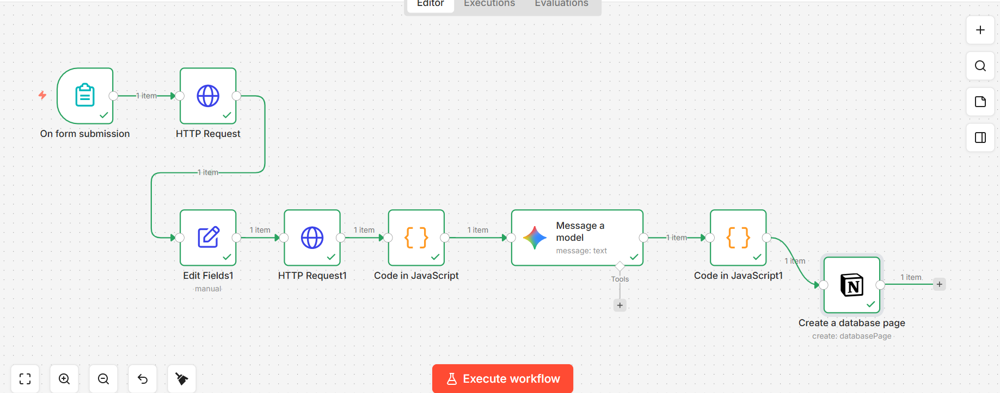

# Lyrics Sentiment Tracker

An n8n automation workflow that takes a song input, fetches its lyrics, runs AI-powered mood and sentiment analysis, and writes the results to a Notion database.

## What it does

You submit an artist name and song title through a form. The workflow fetches the lyrics from Genius, sends them to Gemini for sentiment analysis, and logs the mood, sentiment score, themes, and a summary to Notion automatically.

## Workflow



```
Form Trigger -> Genius API (search) -> Edit Fields (extract URL) -> HTTP Request (fetch lyrics page) -> Code (scrape + clean lyrics) -> Gemini API (sentiment analysis) -> Code (parse JSON) -> Notion (create database page)
```

## APIs Used

- **Genius API** — search and fetch song lyrics pages
- **Google Gemini API** — AI sentiment and mood analysis
- **Notion API** — write results to a database

## Notion Database Structure

| Property | Type |
|----------|------|
| Song | Title |
| Artist | Text |
| Mood | Text |
| Sentiment Score | Number |
| Themes | Text |
| Summary | Text |
| Date Analyzed | Date |

## Setup

### Prerequisites

- n8n (self-hosted or cloud)
- Genius API client access token from [genius.com/api-clients](https://genius.com/api-clients)
- Google Gemini API key from [aistudio.google.com](https://aistudio.google.com)
- Notion internal integration token from [notion.so/profile/integrations](https://www.notion.so/profile/integrations)

### Steps

1. Import the workflow JSON into n8n
2. Set up credentials:
   - Genius: add your client access token as a Header Auth credential (`Authorization: Bearer YOUR_TOKEN`)
   - Gemini: add your API key as a query param in the HTTP Request node URL
   - Notion: paste your internal integration secret into the Notion credential
3. In Notion, create a database with the properties listed above and connect your integration to it (open the database, click `...` > Connections > select your integration)
4. In the Notion node, select your database from the dropdown
5. Activate the workflow and open the form trigger URL

### Running it

Open the form URL generated by n8n, enter an artist name and song title, and submit. Check your Notion database for the new entry.

## Example Output

```json
{
  "mood": "Melancholy, longing",
  "sentiment_score": -0.85,
  "themes": "Insecurity, Unrequited Love, Jealousy, Self-doubt",
  "summary": "The narrator wishes to be someone else who is preferred by the person they love."
}
```

## Future changes

1. Connection with spotify to analyze the last played track 
2. Add it to discord and telegram
3. Send a personalized email to the user based on their mood
